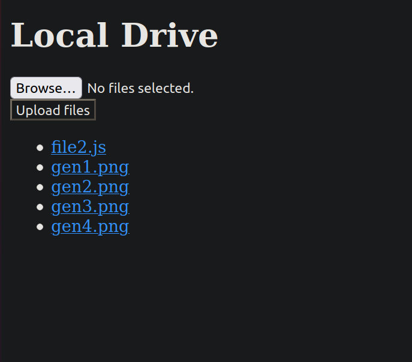

# Local Drive

Upload and download files over a local wifi network. Use HTTP so that clients can access it with a web browser.



# Usage

- Download this repository
- Run the script

```bash
./start.bash
# Example Output
Local Drive listening at http://192.168.123.456:3000
```

- On a device using the same wifi network (e.g. your phone), open a web browser and go to the URL above
- Upload and download files as needed
- Turn off the server with Ctrl+C

## For Development

```bash
# In a terminal, run frontend
cd frontend
ng build --watch

# In a separate terminal, run backend
node index.js
```

# Roadmap

## Done

- Set up frontend and backend folder structure
- Hello world frontend
- Hello world backend
- Can serve main.js, runtime.js, etc.
- frontend can list files
- frontend can download files
- backend can return list of files
- frontend can upload new files
- backend can upload new files
- DuckDuckGo browser app messes up HTML download attribute, saves /files/hello.txt as files.txt and /images/myimage.png as images.png
  - probably off-by-1 error: uses the directory name instead of the basename
- Can delete files
- Shows status message when uploading or deleting

## Todo

# Features

- Client can access server using a web browser and IP address and port
- Client can upload, download, and delete files

# Limitations

- No nested folders allowed
- Can't rename files
- Can't search for files easily (but you can use Ctrl+F)
- Running the project currently requires downloading this repository. Other options:
  - Package it up so it can be npm install-ed globally and run on command line
  - Create executable using node-pkg

# Prerequisites

- Client and Server are on same wifi network
